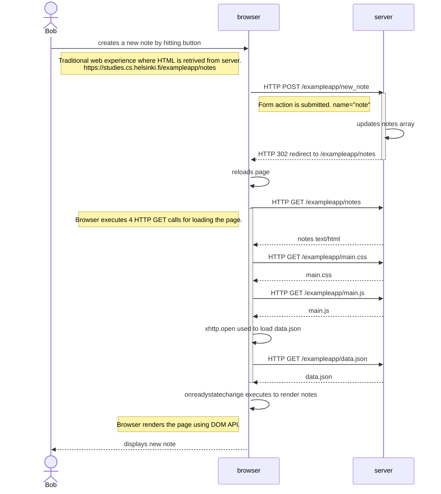

```mermaid
sequenceDiagram
    actor Bob
    participant browser
    participant server

    Bob->>browser: creates a new note by hitting button
    activate browser
    Note right of Bob: Traditional web experience where HTML is retrived from server. <br> https://studies.cs.helsinki.fi/exampleapp/notes
    
    browser->>server: HTTP POST /exampleapp/new_note
    activate server
    Note right of browser: Form action is submitted. name="note"
    
    server->>server: updates notes array

    server-->>browser: HTTP 302 redirect to /exampleapp/notes
    deactivate server

    browser->>browser: reloads page

    browser->>server: HTTP GET /exampleapp/notes
     
    activate browser
    Note left of browser: Browser executes 4 HTTP GET calls for loading the page.
    server-->>browser: notes text/html
    browser->>server: HTTP GET /exampleapp/main.css
    server-->>browser: main.css
    browser->>server: HTTP GET /exampleapp/main.js
    server-->>browser: main.js
    browser->>browser: xhttp.open used to load data.json
    browser->>server: HTTP GET /exampleapp/data.json
    server-->>browser: data.json
    deactivate browser

    browser->>browser: onreadystatechange executes to render notes
    Note left of browser: Browser renders the page using DOM API.

    browser-->>Bob: displays new note

```