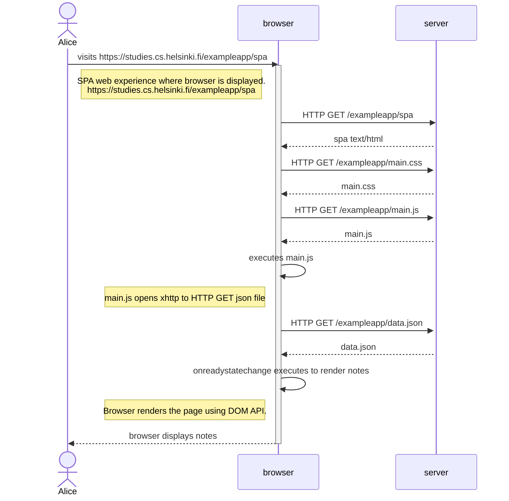

```mermaid
sequenceDiagram
    actor Alice
    participant browser
    participant server

    Alice->>browser: visits https://studies.cs.helsinki.fi/exampleapp/spa
    activate browser
    Note right of Alice: SPA web experience where browser is displayed. <br> https://studies.cs.helsinki.fi/exampleapp/spa

    browser->>server: HTTP GET /exampleapp/spa
    activate server
    
    server-->>browser: spa text/html
    browser->>server: HTTP GET /exampleapp/main.css
    server-->>browser: main.css
    browser->>server: HTTP GET /exampleapp/main.js
    server-->>browser: main.js

    browser->>browser: executes main.js
    Note left of browser: main.js opens xhttp to HTTP GET json file
    browser->>server: HTTP GET /exampleapp/data.json
    server-->>browser: data.json

    browser->>browser: onreadystatechange executes to render notes
    Note left of browser: Browser renders the page using DOM API.

    browser-->>Alice: browser displays notes
    
    deactivate browser
```